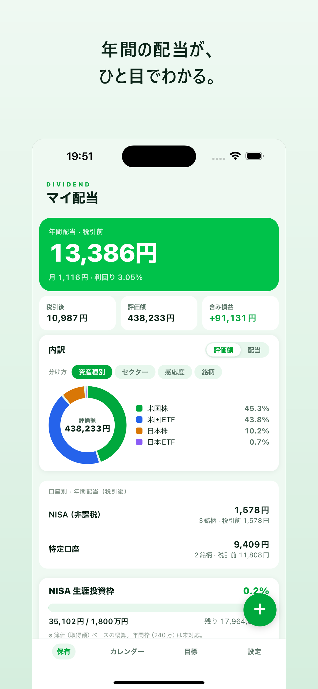
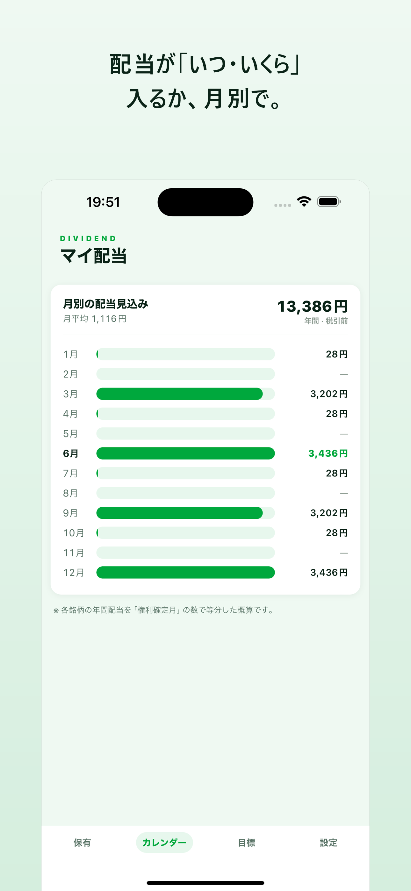
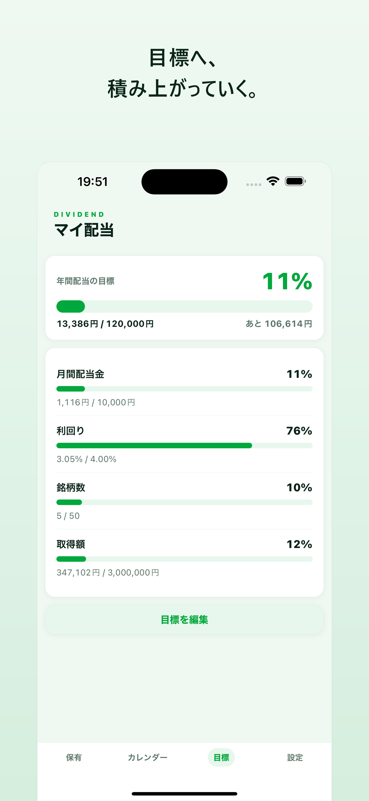

# マイ配当（My Dividend）

高配当株・ETF の「年間いくら・いつ入る」をいちばんシンプルに見える化する、配当管理アプリ。
証券口座と連携せず、データは端末の中だけ。だから軽くて、プライバシーも安心。

**Expo / React Native / TypeScript** で個人開発。要件定義から設計・実装・両ストア公開・OTA 運用までを一人で通した学習兼プロダクト。

<p>
  <a href="https://apps.apple.com/jp/app/id6795317283">App Store（公開中）</a> ・
  <a href="https://mydividend.datz.app">ランディングページ</a> ・
  <a href="https://mydividend.datz.app/privacy.html">プライバシーポリシー</a>
</p>

- **iOS**：App Store で一般公開中（v1.0.0）
- **Android**：Google Play クローズドテスト（v1.0.1 / versionCode 2）
- **配信**：JS のみの修正は EAS Update（expo-updates）で審査なし OTA 配信

---

## スクリーンショット

| 保有一覧 | 配当カレンダー | 目標 vs 実績 |
|:---:|:---:|:---:|
|  |  |  |

---

## 主な機能

**基本トラッカー（無料）**
- 保有銘柄の追加・編集・削除（コード入力で銘柄名・業種を自動補完 / 株数は単元ステッパー）
- 日本株・日本ETF・J-REIT・米国株・米国ETF に対応（ドル建ては為替手入力で円換算）
- 年間配当（税引前／税引後）・平均利回り・**簿価利回り（YOC）**・含み損益・評価額のサマリー
- 月別の**配当カレンダー**
- **目標 vs 実績**（月間/年間配当・利回り・銘柄数・取得額）
- **口座別サマリー**（NISA=非課税 / 特定・一般=課税 を分けて集計）
- NISA 生涯枠（1,800万）の消化ゲージ
- 各銘柄から株探・みんかぶ・IRBANK 等へのワンタップ外部リンク
- 端末内ローカル保存（AsyncStorage）・JSON バックアップ／復元

**可視化・分析**
- 構成ドーナツ（資産種別／セクター／景気感応度／銘柄 × 評価額／配当）
- 構成ツリーマップ・簿価利回りヒストグラム
- 配当月リマインド通知（expo-notifications）

**その他**
- ライト／ダークテーマ・セーフエリア対応
- 免責表示（投資勧誘・助言ではない旨）

## 技術スタック

| 領域 | 使用技術 |
|------|----------|
| フレームワーク | Expo SDK 57 / React Native 0.86 |
| 言語 | TypeScript |
| 永続化 | AsyncStorage（端末内・外部送信なし） |
| 通知 | expo-notifications（ローカル通知） |
| OTA 配信 | expo-updates / EAS Update |
| ビルド・提出 | EAS Build / EAS Submit |
| 品質ゲート | TypeScript 型チェック・ESLint・Jest（純関数の単体テスト）・expo-doctor |
| CI | GitHub Actions |
| LP ホスティング | Cloudflare Pages（`site/` を Git 連携で自動デプロイ） |

## プロジェクト構成

```
.
├── App.tsx              # エントリ（タブUI・状態のオーケストレーション）
├── src/
│   ├── components/      # 画面・UIコンポーネント（フォーム/サマリー/カレンダー/各種グラフ）
│   ├── calc.ts          # 配当・利回り・損益の計算（純関数・テスト対象）
│   ├── backup.ts        # JSONバックアップの生成・検証・取込（テスト対象）
│   ├── storage.ts       # AsyncStorage 永続化
│   ├── stockDirectory.ts# コード→銘柄名+業種の静的辞書（自動補完用）
│   ├── sectorClassification.ts # 東証33業種→景気感応度・外部リンク
│   ├── assetClass.ts    # 資産種別・通貨・円換算
│   ├── notifications.ts # 配当月リマインド
│   ├── types.ts / theme.ts
│   └── __tests__/       # calc / backup / stockDirectory の単体テスト
├── docs/                # 要件定義・設計・マネタイズ・GTM・ロードマップ（ドキュメント駆動の“正”）
├── site/                # ランディングページ + プライバシーポリシー（Cloudflare Pages）
├── store-assets/        # ストア掲載用アイコン・スクショ・フィーチャー画像
├── scripts/             # アイコン/OG 生成スクリプト
├── app.json / eas.json  # Expo / EAS 設定
```

## 開発

前提：Node.js（LTS）と Expo アカウント。ネイティブモジュールを含むため実機確認は EAS Build または開発ビルドを使う。

```bash
npm install          # 依存インストール
npm start            # Metro 起動（Expo）
npm run ios          # iOS シミュレータ
npm run android      # Android エミュレータ/実機
npm run web          # Web プレビュー
```

品質ゲート（3つとも緑を維持）：

```bash
npx tsc --noEmit     # 型チェック
npm run lint         # ESLint
npm test             # Jest 単体テスト
npx expo-doctor      # Expo 依存の健全性
```

ビルド・配信：

```bash
eas build -p android --profile production   # AAB
eas build -p ios --profile production       # IPA
eas submit -p ios                           # App Store 提出
eas update --channel production -m "..."    # JSのみ修正の OTA 配信（審査なし）
```

## ドキュメント

設計は「ドキュメント駆動」。要件定義（02）・基本設計（03）・UI/UX（08）を“正”として実装している。詳細は [`docs/`](docs/00_README.md) を参照。

- [01 競合分析](docs/01_competitive_analysis.md) ・ [02 要件定義](docs/02_requirements.md) ・ [03 基本設計](docs/03_design.md)
- [04 マネタイズ設計](docs/04_monetization.md) ・ [07 集客戦略](docs/07_go_to_market.md) ・ [08 UI/UX 設計](docs/08_ui_ux_design.md)
- [09 成長戦略・実装ロードマップ](docs/09_roadmap.md)

## 設計上の割り切り

- **証券口座 API 連携はしない**：提携・規制の壁に加え、個人開発で多数のユーザーの口座認証情報を預かるのは安全に運用できないため。入力の手間は将来的に**CSV 取込（ログイン不要）**で軽減する方針。
- **データ源は手入力**：株価・配当データの配信ライセンス/規約・コストを避けるため。表示値は利用者の手入力に基づく概算。

## ライセンス

MIT License（`LICENSE`）。

---

> 本アプリは保有配当の記録・可視化を目的としたツールであり、投資の勧誘・助言を行うものではありません。
